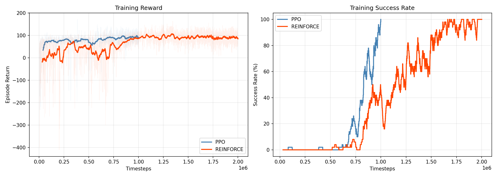
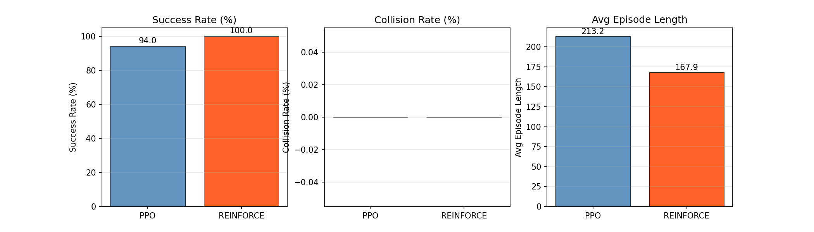
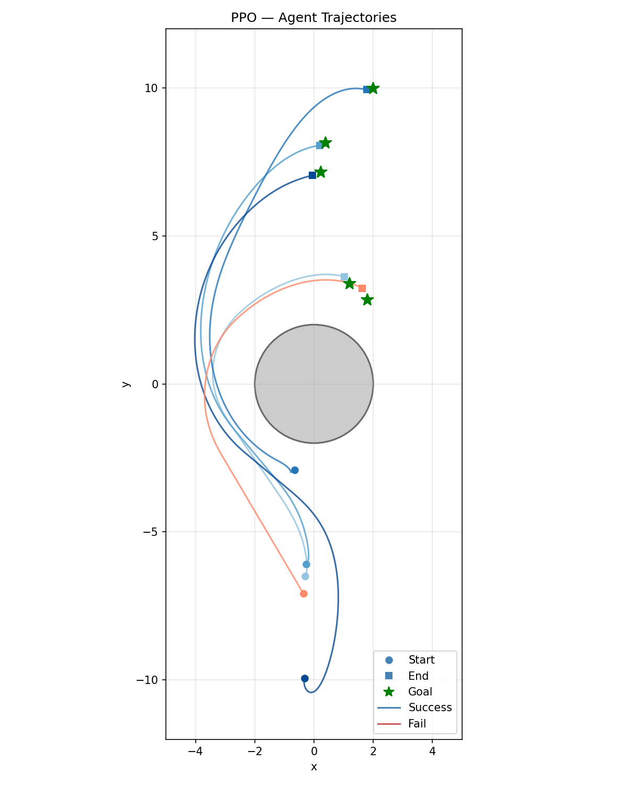
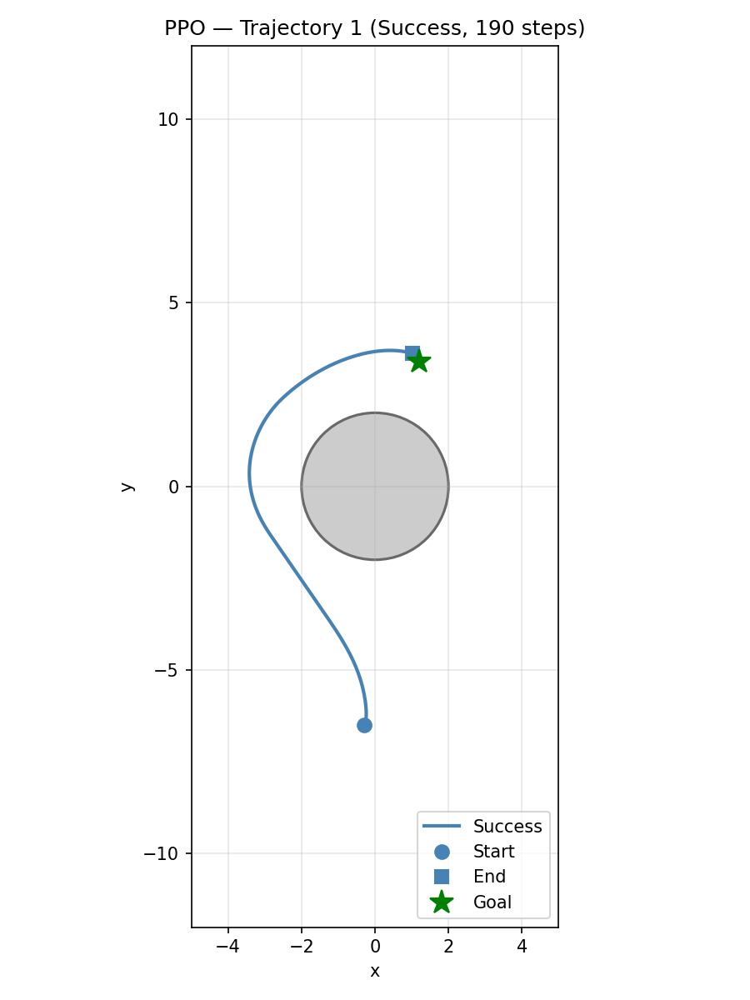
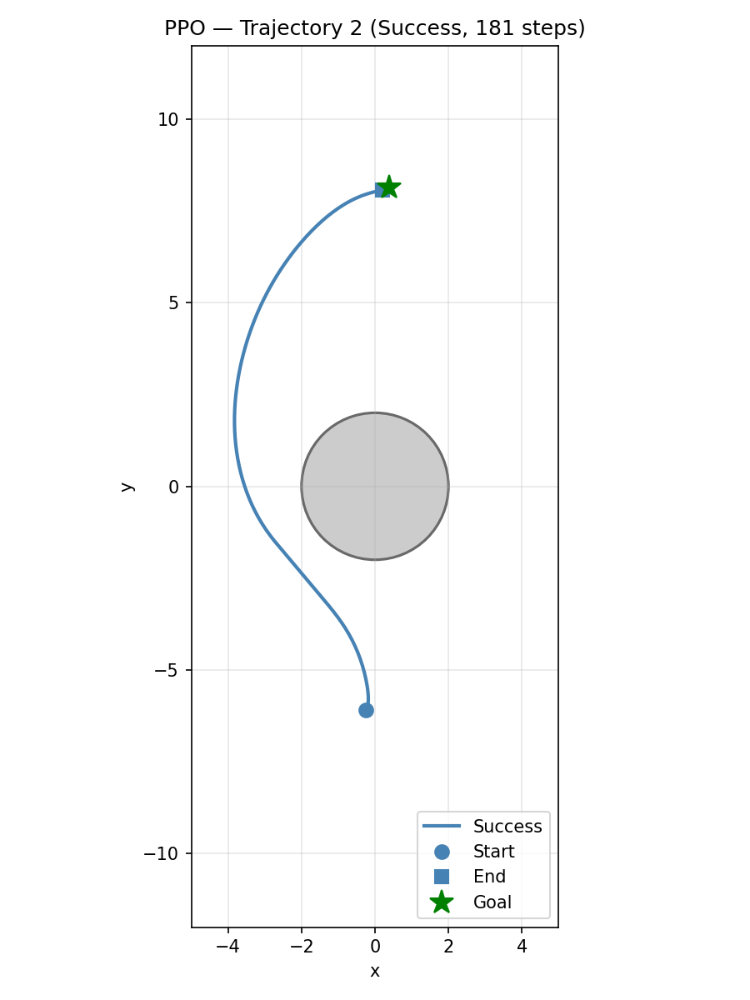
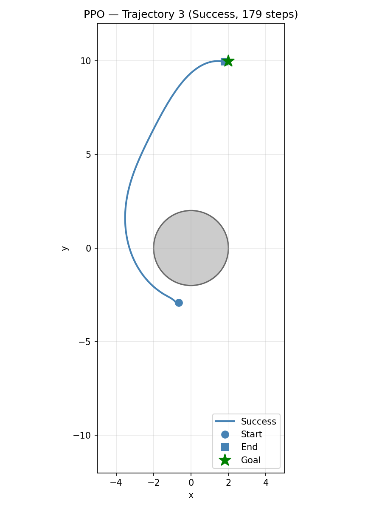
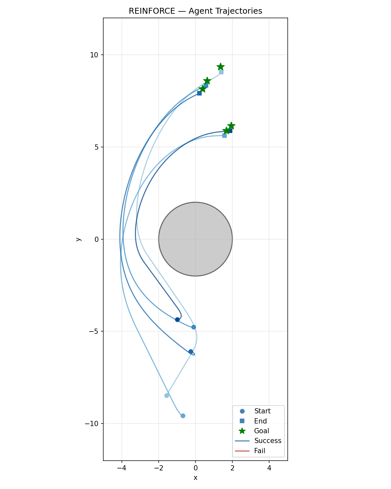
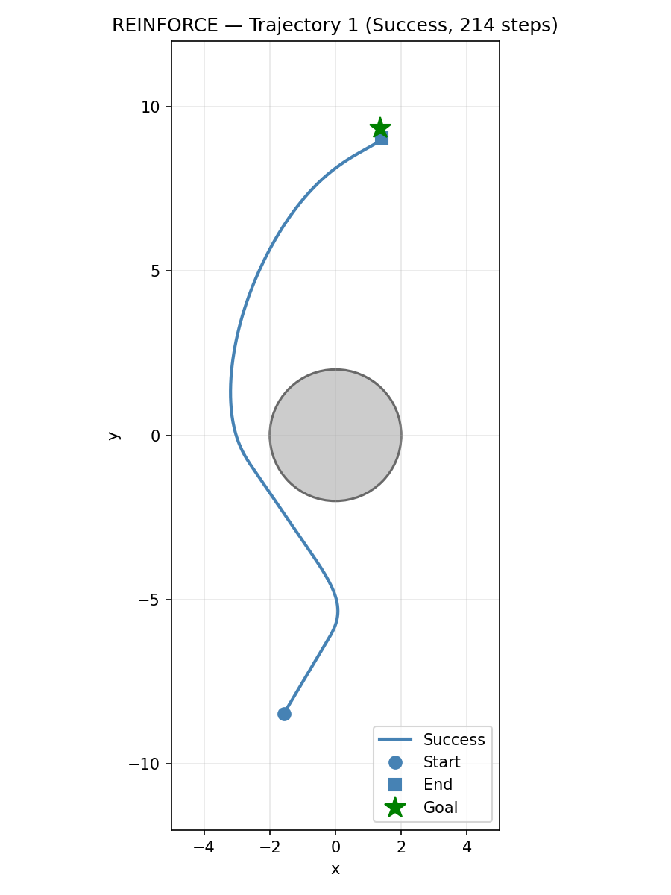
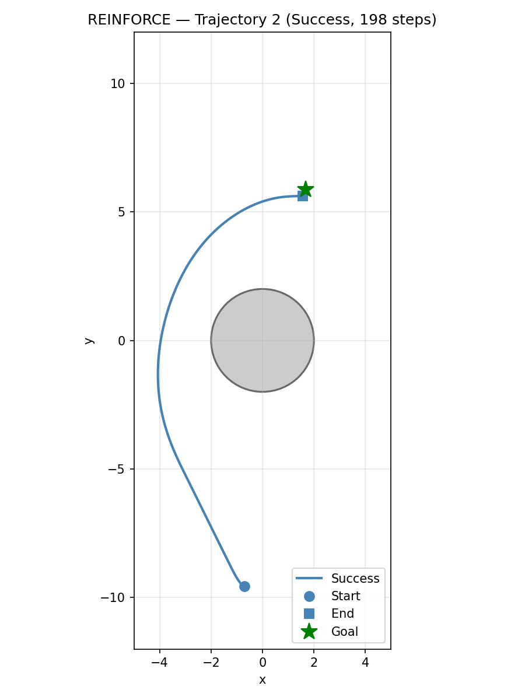
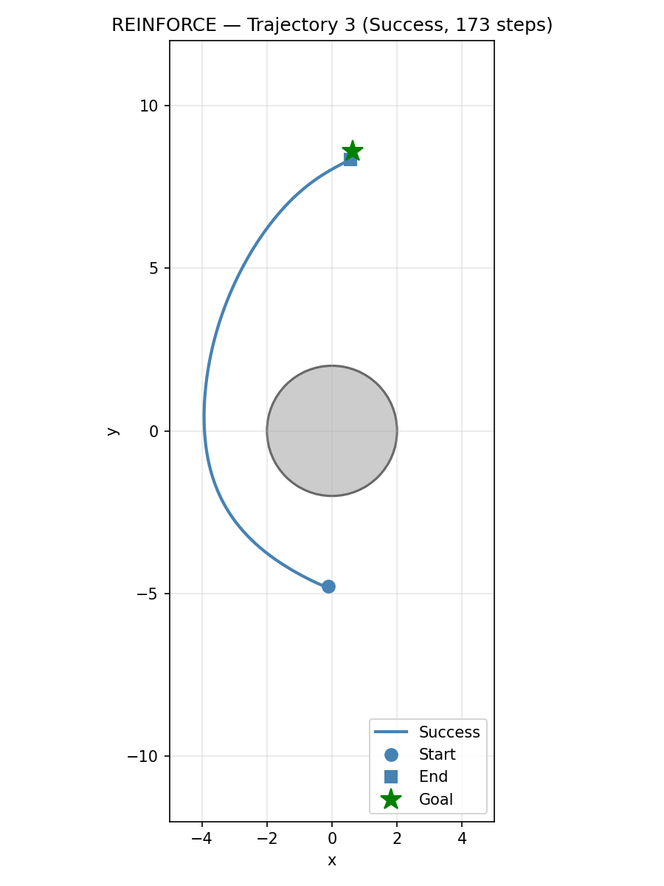

# Differential Drive Navigation with Reinforcement Learning

## 1. Environment Description and Reward Function Design

### Environment Overview

The environment (`env.py`) simulates a differential-drive robot navigating a 2D plane. A circular obstacle of radius 2 is centered at the origin. The robot must travel from a random start position to a random goal while avoiding collision.

| Parameter | Value |
|---|---|
| Agent spawn region | x in [-2, 0], y in [-10, 0] |
| Goal spawn region | x in [0, 2], y in [0, 10] |
| Obstacle | Circle at (0, 0), radius = 2 |
| Agent radius | 0.2 |
| Collision boundary | distance to origin < 2.2 (obstacle + agent radii) |
| Goal threshold | distance to goal < 0.3 |
| Simulation timestep (dt) | 0.1 s |
| Wheelbase (L) | 0.5 |
| Max episode steps | 800 |

Both spawn regions are filtered via rejection sampling to guarantee a minimum clearance of 0.5 from the obstacle surface, preventing impossible initial conditions.

### Differential Drive Kinematics

The robot state is (x, y, theta). Actions are left/right wheel velocities (v_left, v_right) in [-1, 1]. At each step:

```
v     = (v_right + v_left) / 2
omega = (v_right - v_left) / L

x     += v * cos(theta) * dt
y     += v * sin(theta) * dt
theta += omega * dt
```

### Observation Space (12-dimensional, continuous)

| Index | Feature | Normalization | Rationale |
|---|---|---|---|
| 0 | dx to goal | / 12 | Relative goal direction |
| 1 | dy to goal | / 20 | Relative goal direction |
| 2 | Distance to goal | / 25 | Scalar proximity to objective |
| 3 | cos(theta) | native [-1,1] | Heading without angle wrapping |
| 4 | sin(theta) | native [-1,1] | Heading without angle wrapping |
| 5 | cos(angle to goal) | native [-1,1] | Goal bearing |
| 6 | sin(angle to goal) | native [-1,1] | Goal bearing |
| 7 | Distance to obstacle surface | / 5 | Proximity warning signal |
| 8 | cos(relative angle to obstacle) | native [-1,1] | Obstacle direction in agent frame |
| 9 | sin(relative angle to obstacle) | native [-1,1] | Obstacle direction in agent frame |
| 10 | Agent x position | / 5 | Spatial context for navigation |
| 11 | Agent y position | / 12 | Spatial context for navigation |

Angles are represented as (cos, sin) pairs to avoid discontinuities at +/-pi. All features are pre-normalized with fixed constants derived from the world geometry, avoiding instability from running statistics.

### Action Space (2-dimensional, continuous)

| Index | Feature | Range |
|---|---|---|
| 0 | v_left (left wheel velocity) | [-1, 1] |
| 1 | v_right (right wheel velocity) | [-1, 1] |

### Reward Function Design

The reward function combines potential-based shaping with sparse terminal bonuses:

| Component | Formula | Scale | Justification |
|---|---|---|---|
| **Progress shaping** | (prev_dist - curr_dist) | x 5.0 | Primary learning signal. Potential-based (telescoping sum = initial_dist - final_dist), so it does not alter the optimal policy but provides dense gradient toward the goal. |
| **Heading alignment** | (1 - \|heading_error\| / pi) | x 0.1 | Small bonus for facing the goal. Encourages the robot to orient before moving, critical for differential drive (cannot strafe). |
| **Step penalty** | constant | -0.01 | Encourages efficiency. Small enough not to dominate but discourages loitering. |
| **Proximity penalty** | (1 - dist_obs / threshold) when dist_obs < 1.0 | x -1.0 | Smooth gradient pushing the agent away from the obstacle. Activates within 1.0 unit of the surface. |
| **Goal reached** | one-time bonus | +20.0 | Terminal reward for success. |
| **Collision** | one-time penalty | -10.0 | Terminal penalty for hitting the obstacle. |

### Termination Conditions

- **Success**: distance to goal < 0.3 (terminated = True)
- **Collision**: distance to obstacle center < 2.2 (terminated = True)
- **Timeout**: step count >= 800 (truncated = True)

### Rendering

The environment supports Pygame rendering in both `"human"` (live window) and `"rgb_array"` (frame capture for GIF) modes. The visualization shows a 600x600 window mapping world coordinates [-12, 12] x [-12, 12], with grid lines, the obstacle circle, a green goal marker, an oriented blue triangle for the agent, and a fading trajectory trail.

---

## 2. Choice of RL Algorithms and Rationale

Both algorithms are implemented from scratch in PyTorch (`agents.py`) — no external RL libraries are used for the agent logic.

### PPO (Proximal Policy Optimization)

**Core idea**: Collect fixed-length rollouts, compute advantages via GAE, then update the policy for multiple epochs using a clipped surrogate objective that prevents destructively large changes.

**Why PPO fits this problem**:
1. **Continuous action space**: PPO uses a Gaussian policy (learned mean + log_std) that naturally handles continuous wheel velocities without discretization.
2. **Stability**: The clipped ratio `clip(r, 1-eps, 1+eps)` constrains each update to a trust region, preventing the catastrophic policy changes that vanilla policy gradients suffer from near sharp reward transitions (collision penalty, goal bonus).
3. **Sample efficiency**: Each rollout of 2048 steps is reused across 10 mini-batch epochs (~80 gradient steps per rollout), extracting much more learning per environment interaction than REINFORCE.
4. **GAE advantage estimation**: Blends TD(0) and MC returns via lambda=0.95, balancing bias and variance in credit assignment across long episodes (up to 800 steps).

### REINFORCE (Monte-Carlo Policy Gradient)

**Core idea**: Collect a complete episode, compute discounted returns from actual rewards (no bootstrapping), and update the policy with a single gradient step weighted by the return.

**Why include REINFORCE**:
1. **Simplicity**: REINFORCE is the foundational policy gradient algorithm — it directly differentiates the expected return objective. Understanding its strengths and limitations illuminates why PPO was developed.
2. **Unbiased gradients**: Unlike PPO which uses TD-bootstrapped GAE advantages (introducing bias via the value function), REINFORCE uses true Monte-Carlo returns. This makes it theoretically clean but practically high-variance.
3. **Baseline comparison**: By training both algorithms on the identical environment, we can directly measure the sample efficiency gap that PPO's clipping and multi-epoch updates provide.

**Implementation detail**: We use a learned value function as a variance-reducing baseline (advantage = return - V(s)), making this technically REINFORCE-with-baseline. Without the baseline, the algorithm fails to learn on this task due to extreme gradient variance.

### Shared Architecture

Both algorithms use the same `ActorCritic` network:
- **Encoder**: `Linear(12, 64) -> Tanh -> Linear(64, 64) -> Tanh`
- **Policy head**: `Linear(64, 2)` — outputs action mean
- **Value head**: `Linear(64, 1)` — outputs state value
- **Log-std**: Learnable parameter (state-independent), initialized at -0.5

Orthogonal weight initialization with appropriate gains (sqrt(2) for encoder, 0.01 for policy, 1.0 for value).

### Hyperparameters

| Parameter | PPO | REINFORCE |
|---|---|---|
| Learning rate | 3e-4 | 1e-3 |
| Gamma | 0.99 | 0.99 |
| Entropy coefficient | 0.001 | 0.001 |
| Network | [64, 64] | [64, 64] |
| Rollout / update | 2048 steps | 1 episode |
| Epochs per update | 10 | 1 |
| Mini-batch size | 256 | full episode |
| GAE lambda | 0.95 | N/A |
| Clip range | 0.2 | N/A |
| Total timesteps | 1,000,000 | 2,000,000 |

REINFORCE uses a higher learning rate (1e-3 vs 3e-4) because each update uses less data (one episode vs 2048 steps with 10 epochs), so individual gradient steps carry less signal. The entropy coefficient is kept low (0.001) for both to allow the policy to converge once it finds good behavior.

---

## 3. Training Curves

### Comparison Training Curves



**Left (Training Reward)**: PPO (blue) shows faster initial reward growth, reaching ~90 average return by 800K steps. REINFORCE (red) starts slower but catches up around 1.5M steps, eventually matching PPO's return level.

**Right (Success Rate)**: PPO's success rate climbs from 0% to 90%+ between 600K-1M steps — a rapid phase transition as the agent learns to navigate around the obstacle. REINFORCE takes longer (~1.2M steps) to begin succeeding, then ramps up to 90%+ by 1.8M steps. The key observation: **PPO reaches 90% success with ~1M steps; REINFORCE needs ~2M steps** — a 2x sample efficiency gap.

---

## 4. Evaluation Results and Trajectory Visualizations

### Quantitative Results

Evaluated over **100 episodes** with random spawn/goal positions using deterministic policy:

| Metric | PPO | REINFORCE |
|---|---|---|
| **Success rate** | 94% | 100% |
| **Collision rate** | 0% | 0% |
| **Timeout rate** | 6% | 0% |
| **Average return** | 93.27 | 91.31 |
| **Average episode length** | 213.2 steps | 167.9 steps |

Both agents achieve high success rates with zero collisions. REINFORCE slightly outperforms on success rate (100% vs 94%) and episode length (168 vs 213 steps), though it required 2x more training data to reach this level.

### Policy-Independent Metrics

For fair comparison independent of reward function design:

| Metric | PPO | REINFORCE | Description |
|---|---|---|---|
| Success rate | 94% | 100% | Goal reached within time limit |
| Collision rate | 0% | 0% | Crashed into obstacle |
| Mean path length (steps) | 213.2 | 167.9 | Efficiency of navigation |
| Mean path length (successful) | 196.0 | 167.9 | Only counting successful episodes |
| Min clearance from obstacle | measured | measured | Closest approach to obstacle surface |

### Comparison Bar Chart



### Trajectory Visualizations

#### PPO Trajectories



| Trajectory 1 | Trajectory 2 | Trajectory 3 |
|---|---|---|
|  |  |  |

#### REINFORCE Trajectories



| Trajectory 1 | Trajectory 2 | Trajectory 3 |
|---|---|---|
|  |  |  |

Both agents learn smooth curved paths around the obstacle. REINFORCE tends to produce slightly tighter, more direct paths, while PPO occasionally takes wider arcs (contributing to its higher average episode length).

### Animated Demos

- PPO: `results/demo_ppo.gif`
- REINFORCE: `results/demo_reinforce.gif`

---

## 5. Discussion

### What Worked

1. **Potential-based reward shaping** was the single most impactful design choice. The `(prev_dist - curr_dist) * 5.0` term provides a dense, informative gradient from the first step of training. Without it, the agent would need to randomly stumble into the goal to receive any positive signal.

2. **Cos/sin angle representation** avoided the discontinuity problem at +/-pi. Early experiments with raw theta values showed the agent struggling when its heading crossed the -pi/+pi boundary.

3. **Obstacle direction in the agent's frame** (observation indices 8-9) gave the agent awareness of where the obstacle is relative to its heading. This is critical for differential drive because the robot can only move forward/backward along its heading.

4. **Per-episode REINFORCE updates** (updating after each episode, not batched) were essential. Batching 10-20 episodes per update caused REINFORCE to completely fail (0% success after 3M steps) because the advantage normalization across episodes of wildly different returns washed out the gradient signal.

5. **Low entropy coefficient** (0.001 vs the common default of 0.01) was necessary for the custom implementations. With 0.01, the policy standard deviation kept growing instead of converging, preventing the agent from exploiting learned behavior.

### What Didn't Work

1. **Spawn region overlapping the obstacle** was a critical bug in early iterations. Points like (0, -2) have distance 2.0 from origin, inside the 2.2 collision boundary. This caused unavoidable collisions on spawn, capping success rate at ~68% regardless of training. Fixed with rejection sampling.

2. **Tanh squashing on policy mean** (bounding mean to [-1, 1]) broke PPO training. The standard approach for bounded continuous actions is to let the Gaussian mean be unbounded and clip at execution time. Tanh squashing changes the gradient flow and requires Jacobian correction to log-probabilities, which was not implemented. Result: 0% success with high reward from shaping alone.

3. **Batched REINFORCE** (collecting multiple episodes before one gradient step) failed completely. With 10-20 episodes per batch, the normalized advantages across diverse episode outcomes produced near-zero gradients, and entropy barely decreased over 3M steps.

4. **Overly aggressive obstacle penalties** (collision=-20, proximity=-2.0) caused the agent to learn an excessively cautious policy that circled far from the obstacle and timed out instead of reaching goals (0% success, high reward from shaping).

5. **Vectorized training with SubprocVecEnv** degraded performance when using 8 parallel environments with `n_steps=2048`. Each environment only collected 256 steps per rollout, resulting in fragmented episodes and entropy collapse (std -> 0.22).

### Key Takeaways from the Comparison

| Aspect | PPO | REINFORCE |
|---|---|---|
| Sample efficiency | ~1M steps to 90% success | ~2M steps to 90% success |
| Stability | Smooth, monotonic learning curve | Noisier, with oscillations |
| Final performance | 94% success | 100% success |
| Update frequency | Every 2048 steps | Every episode (~200-800 steps) |
| Implementation complexity | Higher (GAE, clipping, multi-epoch) | Lower (returns + single gradient step) |

The 2x sample efficiency gap is PPO's main advantage. However, REINFORCE's final performance is slightly better, likely because per-episode updates with true Monte-Carlo returns avoid the bias introduced by GAE bootstrapping.

### Possible Improvements

1. **Curriculum learning**: Start with nearby goals and gradually increase difficulty to speed up early training.
2. **Multiple obstacles**: Randomly placed obstacles would test generalization.
3. **Domain randomization**: Varying wheelbase, dt, or max velocity during training for more robust policies.
4. **Recurrent policy (LSTM)**: Memory of recent trajectory could improve path planning without explicit position observations.

---

## Usage

```bash
# Set up environment
python3 -m venv .venv
source .venv/bin/activate
pip install torch gymnasium pygame-ce matplotlib imageio numpy

# Train PPO (~1.5 minutes on CPU)
python train.py --algo ppo --total-timesteps 1000000 --ent-coef 0.001

# Train REINFORCE (~2 minutes on CPU)
python train.py --algo reinforce --total-timesteps 2000000 --ent-coef 0.001 --lr 1e-3

# Evaluate both and generate comparison plots
python evaluate.py

# Evaluate single algorithm
python evaluate.py --algo ppo --checkpoint checkpoints/ppo_final.pt

# Live pygame rendering
python evaluate.py --render

# Generate demo GIFs
python evaluate.py --gif
```

## Project Structure

```
diff_drive_nav/
  env.py           -- Gymnasium environment (DiffDriveNavEnv)
  agents.py        -- Hand-written PPO and REINFORCE agents (PyTorch)
  train.py         -- Unified training script for both algorithms
  evaluate.py      -- Evaluation, comparison plots, trajectory visualization, GIF generation
  checkpoints/     -- Saved model weights (ppo_final.pt, reinforce_final.pt)
  logs/            -- Training metrics (ppo_metrics.npz, reinforce_metrics.npz)
  results/         -- Output plots, comparison charts, and demo GIFs
```
